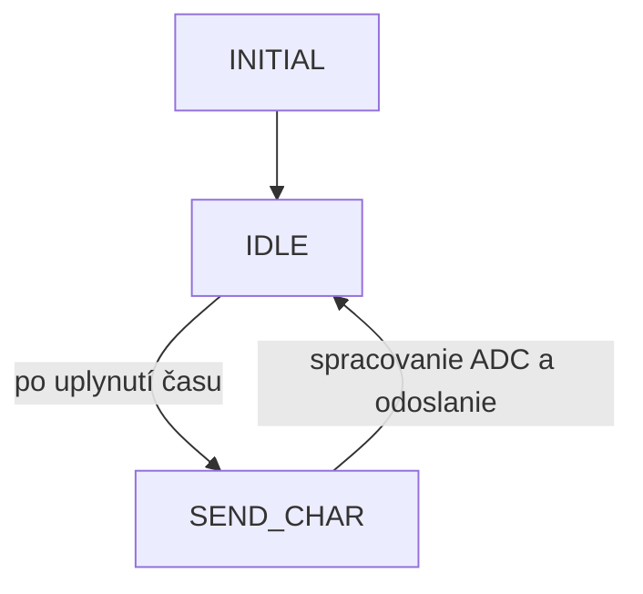

# Project Bilka

**Autor**: Student  
**Vytvorené**: 31.3.2025  

Program pre snímanie obsadenia miesta pomocou FSR senzora a bezdrôtovú komunikáciu.

---

## Obsah

- [Popis projektu](#popis-projektu)
- [Použité knižnice](#použité-knižnice)
- [Hardvérové požiadavky](#hardvérové-požiadavky)
- [Inštalácia a spustenie](#inštalácia-a-spustenie)
- [Architektúra programu](#architektúra-programu)
- [Stavový diagram](#stavový-diagram)
- [Príklad výstupu](#príklad-výstupu)

---

## Popis projektu

Tento projekt realizuje:
- Snímanie tlaku pomocou FSR senzora cez ADC.
- Odosielanie nameraných hodnôt cez bezdrôtovú sieť (pravdepodobne Zigbee).
- Spracovanie a zobrazovanie prijatých hodnôt cez UART terminál.
- Indikáciu obsadenia miesta na základe prahovej hodnoty.

## Použité knižnice

- `avr/io.h`, `util/delay.h`, `avr/interrupt.h` - Nízkoúrovňové ovládanie MCU
- `stdlib.h`, `stdio.h`, `string.h`, `math.h` - Štandardné knižnice C
- Projektové knižnice:
  - `config.h`, `hal.h`, `phy.h`, `sys.h`, `nwk.h`, `sysTimer.h`
  - `halBoard.h`, `halUart.h`, `makra.h`, `main.h`
  - `uart/uart.h`

## Hardvérové požiadavky

- **Mikrokontrolér**: AVR (napr. ATmega)
- **Senzor**: FSR (Force Sensitive Resistor)
- **Komunikačný modul**: Zigbee či podobný
- **Pripojenie k PC**: UART/USB
- **Napájanie**: 3.3V alebo 5V podľa MCU

## Inštalácia a spustenie

1. Nahrajte projekt do AVR mikrokontroléra (napr. cez Atmel Studio alebo avrdude).
2. Pripojte FSR senzor na ADC kanál 0.
3. Spustite UART terminál s nastaveniami:
   - Baudrate: 38400
   - 8 data bits, no parity, 1 stop bit
4. Sledujte hodnoty ADC a hlášky o obsadení.

## Architektúra programu

**Hlavné komponenty:**

- **Inicializácie**
  - `SYS_Init()`, `board_init()`, `adc_init()`, `HAL_UartInit()`
- **Aplikácia**
  - Stavový automat s tromi stavmi: `INITIAL`, `SEND_CHAR`, `IDLE`
- **Snímanie a odosielanie**
  - Čítanie hodnoty cez `adc_read()`.
  - Odosielanie dát pomocou `NWK_DataReq()`.
- **Prijímanie**
  - `HAL_UartBytesReceived()`, `appDataInd()`
- **Spracovanie časovača**
  - `SYS_Timer_t` pre timeout flush bufferu

## Stavový diagram



## Príklad výstupu

```
-------------------------------------
Vitaj v programe pre snimanie obsadenia pomocou FSR senzora!
Odoslana ADC Value: 254
Miesto je obsadene!
Odoslana ADC Value: 23
Miesto nie je obsadene.
```

## Poznámky

- Projekt implementuje jednoduchú bezdrôtovú sieťovú komunikáciu s podporou zabezpečenia.
- Obsahuje štandardné UART rozhranie pre ladenie.
- Predpokladá sa podpora rôznych šírok čítaných hodnôt cez ADC.

---

> Pre väčšie projekty je odporúčané rozšírenie správy siete, viackanálových ADC čítaní a správy energie MCU.